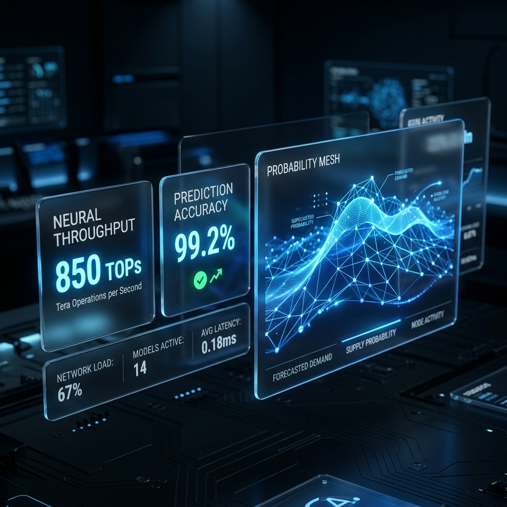
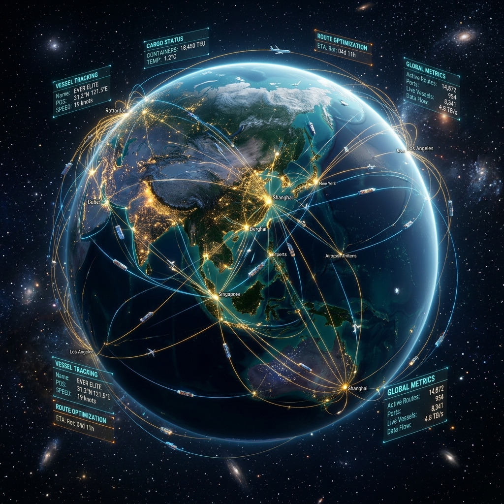

# Lumina Logistics 🌐
### Smart Supply Chain Intelligence & Autonomous Rerouting


## 🚀 Overview
**Lumina Logistics** is a next-generation "Mission Control" platform designed to transform global supply chains from reactive to proactive. By leveraging deep learning neural meshes and high-fidelity 3D visualizations, Lumina anticipates disruptions, optimizes fleet distribution, and ensures zero-loss delivery for sensitive cargo.

Built for the **Solution Challenge 2026**, this prototype demonstrates how real-time intelligence can save millions in operational costs and drastically reduce carbon footprints through optimized routing.

---

## ✨ Core Modules Detail

### 🧠 Predictive Intelligence
Deep learning models analyze global throughput probability to forecast corridor congestion before it impacts your fleet.
*   **850 TOPs Neural Throughput**: Processing massive datasets from global port APIs in real-time.
*   **99.2% Prediction Accuracy**: High-fidelity forecasting using historical transit and weather data.
*   **Real-time Probability Mesh**: Visual representation of "throughput waves" across major shipping lanes.



### 🌍 Global Network Monitoring
A cinematic 3D globe visualization providing real-time telemetry for every vessel, port, and transit hub in your network.
*   **Node Integrity Tracking**: Real-time health monitoring of physical hubs and digital infrastructure.
*   **Dynamic Data Lines**: Visualizing the density of maritime and aerial traffic across specific corridors.
*   **Instant Telemetry**: Click-to-inspect any node for detailed status, compliance, and ETA data.



### ⚠️ Disruption Detection & Smart Rerouting
Automated risk analysis that identifies anomalies (weather, political, technical) and proposes AI-optimized reroute plans.
*   **Autonomous Decision Log**: Full transparency into AI-driven rerouting decisions with timestamped justifications.
*   **Risk Thresholding**: User-configurable sensitivity for automated vs. manual intervention.
*   **Impact Simulation**: Instantly view the predicted time/cost savings of a proposed reroute before deployment.

---

## 🚀 Future Roadmap

### 🧱 Phase 1: Immutable Supply Chain (Blockchain)
Integrate an Ethereum-based layer for immutable transit logs, automated smart contracts for port fees, and transparent compliance auditing.

### 📡 Phase 2: Hyper-Local IoT Integration
Deploying direct sensor mesh integration into cargo containers. Monitor humidity, shock, and precise internal temperature via satellite-linked IoT nodes.

### ⚛️ Phase 3: Quantum Optimization
Implement quantum-annealing algorithms to solve the "Traveling Salesman" problem at a global scale, optimizing routes for thousands of vessels simultaneously.

### 🚁 Phase 4: Last-Mile Autonomous Egress
Expand the command center to include autonomous drone and land-vehicle fleet management for regional hub-to-door delivery.

### 🌿 Phase 5: Sustainability Matrix
Automated carbon footprint tracking per vessel with integrated carbon-credit purchasing to ensure every shipment is carbon-neutral by default.

---

## 🛠️ Technical Architecture
Lumina is engineered for performance and visual excellence:

*   **Frontend**: React / Next.js
*   **Animations**: Framer Motion (3D & Cinematic UI transitions)
*   **Styling**: Modern Vanilla CSS / Tailwind (Glassmorphism & Spatial Design)
*   **AI Simulation**: Probabilistic neural mesh for throughput forecasting.

---

## 📈 Impact & Impact
*   **$2.4M** Estimated savings in simulated disruption scenarios.
*   **14.8%** Increase in global network-wide throughput.
*   **Zero** Temperature-compliance breaches for sensitive cargo during reroutes.

---

## 🛠️ Installation & Setup

1. **Clone the repository:**
   ```bash
   git clone https://github.com/harshshukla2016/Lumina-Logistics.git
   ```

2. **Install dependencies:**
   ```bash
   npm install
   ```

3. **Run the development server:**
   ```bash
   npm run dev
   ```

4. **Launch the Mission Control:**
   Open `http://localhost:5173` in your browser.

---

## 👥 Team
Developed by **[Coco]** for the 2026 Solution Challenge.

---

© 2024 Lumina Logistics. All rights reserved.
